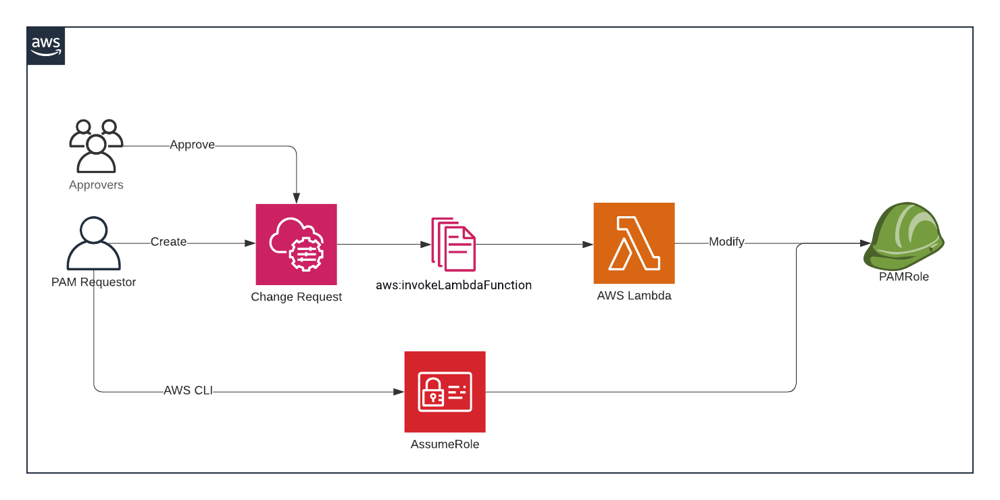

# PAM in AWS using AWS Change Manager 


This repo is the companion to `Just enough PAM`.

It creates
* A Lambda that creates and modifies an IAM Role that serves as a privileged role
* An IAM Role with privileges, in this case EC2Describe
* An Automation Document, that invokes our Lambda
* A Change Template


This is what the process looks like.



## Get Started

1. An AWS Account in an AWS Organization. Alternatively make sure to remove the condition from the `PAMTrustPolicy.json`
2. A user pool for AWS Change Manager by going to [Change Manager Settings](https://eu-west-1.console.aws.amazon.com/systems-manager/change-manager?region=eu-west-1#/dashboard/settings) for this demo we will a user `Template_Manager` . You can change this at the [Change Template](SSM/ChangeTemplate.yaml)
3. Create a change template using this [Change Template](SSM/ChangeTemplate.yaml) by pasting into the editor..
5. You can now [Deploy the Lambda and Automation Document](README.md#Deploy).
6. You can create a Change Request and have the Template_Manager user created in step 2, approve it.

### Deploy

```sh
npm install serverless@2.31.0
cd PAM
serverless deploy --stage="dev" -v
```
:tada:

### Remove

```sh
serveless remove --stage="dev" -v
```